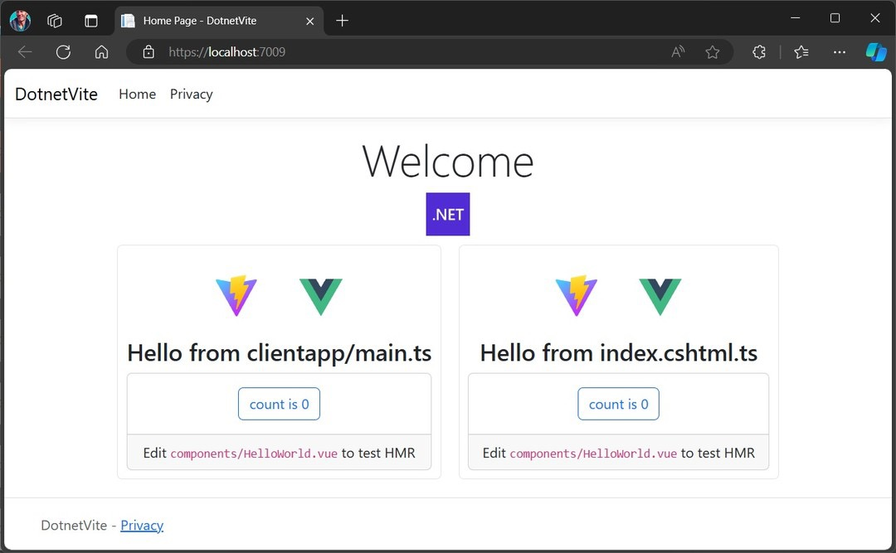

# DotnetVite Demo App

This proof-of-concept application demonstrates the integration of ASP.NET Core with Vite, showcasing an approach to bundling in a hybrid multi-page application using .NET.

## 🎯 Purpose

The primary goal of this sample code is to demonstrate:

1. Using Vite/Rollup bundling in an ASP.NET Core hybrid multi-page application
2. Associating TypeScript files with Razor views, similar to the built-in CSS isolation feature

## 🚀 Key Features

- **ASP.NET Core** backend
- **Vite** for fast and efficient bundling
- **TypeScript** support
- **Razor Pages** integration
- **cshtml.ts files** as entry points for Razor views

## 🌟 Main Concept: cshtml.ts Integration

The core feature of this demo is the use of `cshtml.ts` files as entry points for Razor views. This approach offers several advantages:

1. **Colocation**: Define client-side code in the same location as your Razor view
2. **Tree-shaking**: Benefit from Vite's tree-shaking capabilities for your client-side code
3. **Code splitting**: Automatically chunk your client-side code for optimal loading
4. **Improved navigation**: Easier to locate and manage associated client-side code for each view

### How it works:

1. Create a `[ViewName].cshtml.ts` file alongside your Razor view
2. Write your TypeScript code in this file
3. Vite/globby gathers these files and turns them into entry points for each page
4. The build process bundles these files, making them available to your Razor views

Example:
```typescript
// Index.cshtml.ts
console.log('This script is associated with the Index view');
```

## 🛠️ Setup and Installation

1. Clone the repository
2. Navigate to the project directory
3. Run `dotnet restore` to restore .NET dependencies
4. Run `npm install` or `pnpm install` to install frontend dependencies
5. Run `npm run dev` to start the Vite development server
6. Use `dotnet run` to start the application

## 💻 Development Mode

While hot module replacement (HMR) is possible with Vite.AspNetCore, this sample takes a different approach:

- In development mode, all files are written to disk
- The sample utilizes ASP.NET Core's built-in hot reloading to update on changes
- This approach provides a simpler setup while still offering quick feedback during development

## 📦 Dependencies

This project uses [Vite.AspNetCore](https://github.com/Eptagone/Vite.AspNetCore) to enable reading the Vite manifest for generating links to bundled files in Razor views.

## 📚 Next Steps

- Add a tag helper <script asp-entry\> to automatically associate code with page
- How to handle nested razor, components?

## 📄 License

This project is open source and available under the [MIT License](LICENSE).
